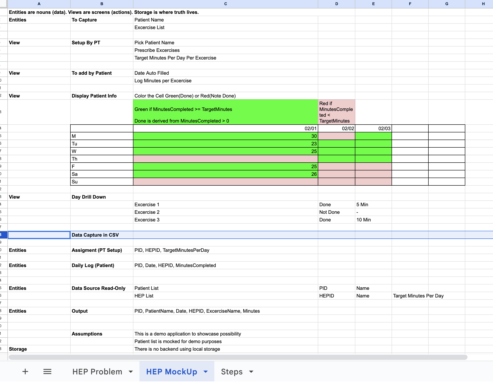

# HEP Tracker — Demo Over Deck

## Problem (Real, Mundane, Painful)

Physical and Occupational Therapists routinely prescribe Home Exercise Programs (HEPs).
What breaks is not clinical knowledge — it is **follow-through**.

- Patients forget what to do
- Compliance is tracked inconsistently
- Therapists chase adherence manually
- EHRs provide poor or fragmented support

This creates both administrative burden and poor outcomes.

---

## Why This Is an Ideal Teaching Demo

This problem is intentionally **not flashy**.

It is perfect because:
- It sits at the intersection of workflow + human behavior
- It is universal across PT / OT / rehab settings
- It is small enough to prototype honestly
- It exposes where EHRs stop helping

Students can understand the pain immediately.

---

## The Mini App (Deliberately Scoped)

This demo does **one thing well**.

**Therapist side**
- Define a small set of exercises (2–5)
- Set expected minutes per exercise

**Patient side**
- Select their name
- Log minutes completed for each exercise
- Submit a daily entry

**System**
- Stores entries
- Aggregates into a weekly compliance view
- Shows patterns, not perfection

No accounts.  
No authentication.  
No scale fantasies.

## Early Sketch (Intent Before Code)

Before writing any code, this demo started as a **spreadsheet-style sketch** to clarify:
- what data exists
- who enters it
- how it rolls up into a weekly view

This sketch acted as the *source of truth* for intent and scope.

Figure: Original spreadsheet sketch used to reason about entities, views, and storage before implementation.

---

## Demo Flow (What We Show Live)

1. Select a patient
2. View their weekly compliance grid
3. Switch to the daily logger
4. Enter today’s minutes
5. Save
6. Watch the weekly view update immediately

The “wow” moment is not the UI.  
It is **the feedback loop**.

---

## Why We Chose This Problem

- It mirrors real admin pain clinicians complain about daily
- It demonstrates how small tools can live *around* EHRs
- It shows how founders can test ideas without slide decks
- It highlights behavior change, not feature count

This is a demo that invites better questions.

---

## Teaching Objective

This app exists to prove one idea:

> You do not need a perfect product to have a meaningful conversation.

You need:
- clarity of intent
- a working loop
- something users can touch

That is what replaces guessing with learning.